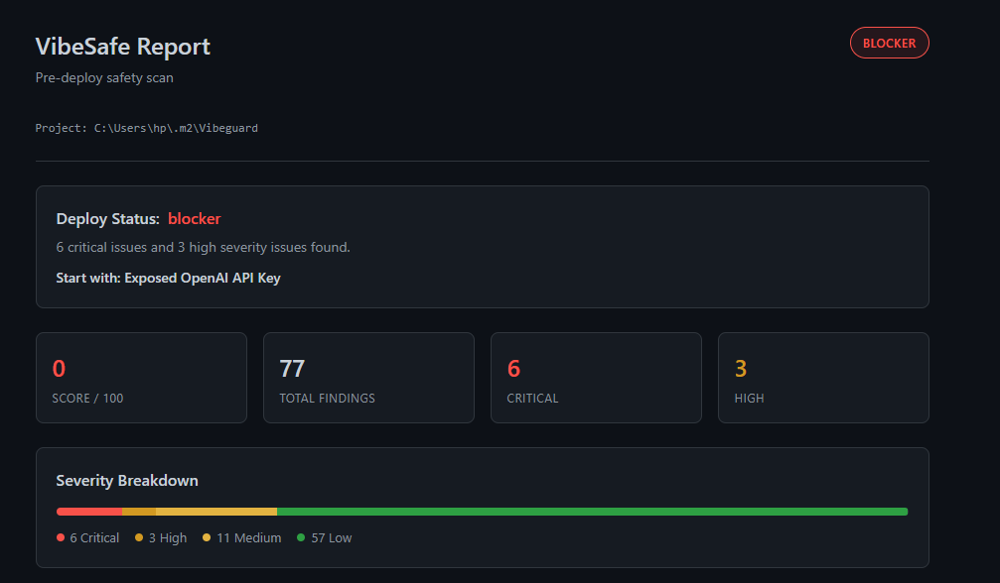
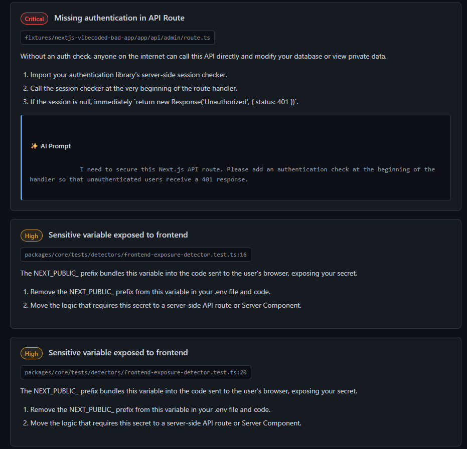
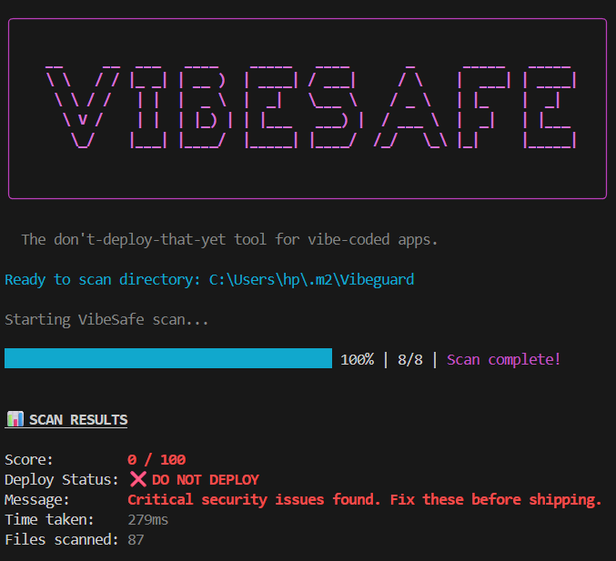

<div align="center">
  <h1>🛡️ VibeSafe</h1>
  <p><strong>The Pre-Deploy Safety Scanner for Vibe-Coded Apps</strong></p>
  <p>
    <a href="https://www.npmjs.com/package/@vibesafe/cli"></a>
    <a href="https://marketplace.visualstudio.com/items?itemName=talaljaber.vibesafe"></a>
    
  </p>
</div>

<hr />

## 🚨 The "Vibe Coding" Problem
"Vibe coding" with AI tools (like Cursor, GitHub Copilot, or Claude) is incredibly fast and fun, but it often leads to messy codebases, exposed secrets, and subtle security flaws. 

**VibeSafe** acts as your automated security engineer. It scans your code before you deploy and tells you exactly what to fix, complete with copy-pasteable AI prompts and one-click auto-fixes.

---

### Before / After
- **Before:** Secrets hardcoded, empty `.env.example`, missing dependency declarations.
- **After:** Clean `.env.example`, safer configurations, and fewer obvious deployment risks.

### Dashboard and CLI Reports

<p align="center">
  
  
</p>

<p align="center">
  
</p>---

## 📦 Installation & Usage

### 💻 Command Line Interface (CLI)

You can run VibeSafe instantly using `npx`, or install it locally in your project.

> [!NOTE]
> **For Local Testing / Contributors:** If you have cloned this repository and want to test your local changes on *other* projects on your computer, DO NOT use `npx @vibesafe/cli` as it will download the published version from NPM. Instead, link it globally:
> ```bash
> cd packages/cli
> npm link
> ```
> Then, in any other folder on your computer, you can run the local build directly:
> ```bash
> vibesafe scan . --html
> ```

**Option 1: Run instantly (No installation)**
```bash
npx @vibesafe/cli scan .
```

**Option 2: Install locally in your project**
```bash
npm install -D @vibesafe/cli
# or
pnpm add -D @vibesafe/cli
# or
yarn add -D @vibesafe/cli
```

Once installed, you can run the scanner via your package manager:
```bash
npx vibesafe scan .
# or pnpm vibesafe scan .
```

**CLI Commands & Options:**
- `npx @vibesafe/cli scan .` - Scans the current directory and outputs a detailed **Repair Plan** to your terminal.
- `npx @vibesafe/cli scan . --html` - Scans the directory and generates a beautiful `vibesafe-report.html` dashboard.
- `npx @vibesafe/cli scan . --open-report` - Generates the HTML dashboard and opens it in your default browser automatically.
- `npx @vibesafe/cli --help` - Shows all available options and commands.

```text
╭────────────────────────────────────────────────────────────────────────╮
│                                                                        │
│    __     __  ___   ____    _____   ____       _      _____   _____    │
│    \ \   / / |_ _| | __ )  | ____| / ___|     / \    |  ___| | ____|   │
│     \ \ / /   | |  |  _ \  |  _|   \___ \    / _ \   | |_    |  _|     │
│      \ V /    | |  | |_) | | |___   ___) |  / ___ \  |  _|   | |___    │
│       \_/    |___| |____/  |_____| |____/  /_/   \_\ |_|     |_____|   │
│                                                                        │
│                                                                        │
╰────────────────────────────────────────────────────────────────────────╯

  The don't-deploy-that-yet tool for vibe-coded apps.

Ready to scan directory: ./my-vibecoded-app
Starting VibeSafe scan...

📊 SCAN RESULTS
Score:         4 / 100
Deploy Status: ❌ DO NOT DEPLOY
Message:       Critical security issues found. Fix these before shipping.
...
🛠️  REPAIR PLAN
Found 7 issues needing your attention. Expected fix time: ~70 mins.
...
```

### 🔌 VS Code Extension

Prefer working entirely within your editor? Install the **VibeSafe** extension!

1. Search for **VibeSafe** in the VS Code Extensions marketplace and click Install.
2. Open the Command Palette (`Ctrl+Shift+P` / `Cmd+Shift+P`).
3. Run **`VibeSafe: Scan Project`**.
4. View issues natively in the sidebar, get AI fix prompts, and apply automated safe fixes right from your editor.

---

## ⚠️ Known Limitations (v0.1)

VibeSafe is currently in early release (v0.1) and is meant to catch the most common "vibe-coding" mistakes. Please be aware of the following:
- **Rule Engine Scope:** The built-in detectors currently cover a core set of issues (secrets, `.env` mismatches, basic codebase mess). Advanced static analysis or data flow tracking is not yet implemented.
- **Auto-fixes:** Some auto-fixes might require manual review to ensure they don't alter intended app logic.
- **Performance:** Scanning very large monorepos with hundreds of thousands of lines of code may take longer than expected. We are actively working on performance optimizations.

---

## 🗺️ Roadmap

- [ ] **v0.2:** Expanding the core ruleset to cover more frontend framework-specific pitfalls (Next.js, Vue, Svelte).
- [ ] **v0.3:** Support for custom, user-defined rules and configurations (`vibesafe.config.js`).
- [ ] **v0.4:** Integration with SARIF and GitHub Actions for automated PR reviews.
- [ ] **v1.0:** Stable release with comprehensive reporting and enterprise-grade speed.

---

## 🤝 Contributing

We love contributions! Whether it's adding new detectors, fixing bugs, or improving documentation, your help is welcome.

Please see our [Contributing Guide](CONTRIBUTING.md) for details on how to get started.

## 🏗️ Monorepo Structure

This project is structured as a `pnpm` monorepo:

- `packages/core`: The main scanning engine and detectors (secrets, auth, codebase mess).
- `packages/shared`: Shared types, interfaces, and configurations.
- `packages/cli`: The interactive command-line interface.
- `packages/vscode`: The Visual Studio Code extension.

## 🛠️ Local Development

To run VibeSafe locally:

1. Clone the repository:
   ```bash
   git clone https://github.com/talaljaber/vibesafe.git
   cd vibesafe
   ```

2. Install dependencies using `pnpm`:
   ```bash
   pnpm install
   ```

3. Build all packages:
   ```bash
   pnpm run build
   ```

4. Run the CLI locally:
   ```bash
   pnpm --filter @vibesafe/cli exec vibesafe scan .
   ```

## 📝 License

[MIT](LICENSE)
